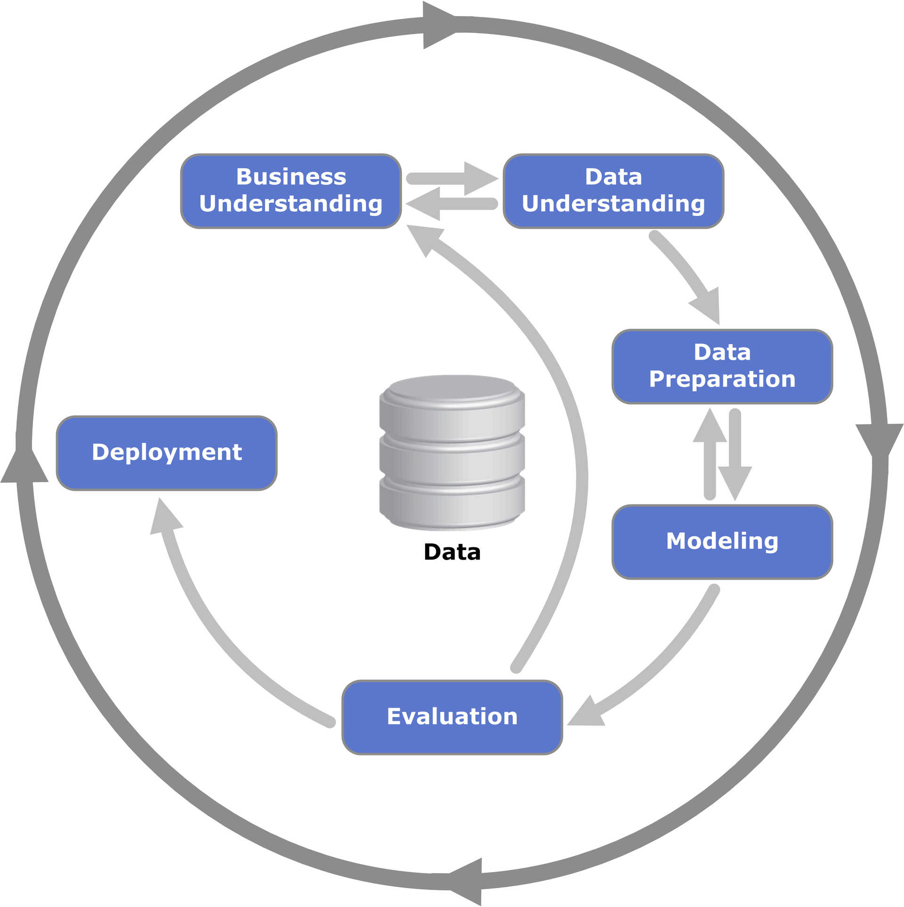

<div align="center">

# Marketing Campaign Response Prediction Project

</div>

## CRISP-DM Methodology

CRISP-DM is like our roadmap for exploring and understanding data. It breaks down complex data projects into manageable steps, starting from understanding what the business needs are, all the way to deploying our solutions. It's super helpful because it keeps us organized and ensures we're on track with our goals. Plus, it's not just for one specific industry, so we can apply it to all sorts of projects, which is awesome for learning and building our skills. It's basically our guide to navigating the world of data mining!

<p align="center">
  
</p>

<p align="center">
  CRISP-DM process diagram
</p>

*    **Business Understanding**: determine business objectives; assess situation; determine data mining goals; produce project plan
*    **Data Understanding**: collect initial data; describe data; explore data; verify data quality
*    **Data Preparation** (generally, the most time-consuming phase): select data; clean data; construct data; integrate data; format data
*    **Modeling**: select modeling technique; generate test design; build model; assess model
*    **Evaluation**: evaluate results; review process; determine next steps
*    **Deployment**: plan deployment; plan monitoring and maintenance; produce final report; review project (deployment was not required for this project)

[Reference](https://github.com/mbenetti/CRISP-DM-Rossmann/blob/master/README.md)

### Objective  

The customer whishes to build a model to predict everyday at 15h00 the total number of bikes they will rent the following day. This will allow them not only to better allocate staff resources, but also to define their daily marketing budget in social media which is their principal form of advertisement.

### Model building

To achieve the objective, it is followed a systematic approach, CRISP-DM, that involves several stages. It is started by preparing the data, cleaning, and organizing it for analysis. Next, perform exploratory data analysis (EDA) to gain insights into the dataset and identify any patterns or trends. Once I have a thorough understanding of the data, it is proceed to train and evaluate predictive models using 4 different machine learning techniques with their best parameters such as:

1. Random Forest Regressor
2. XGBoost
3. GradientBoosting
4. Lasso Regression (best)

It is tried to explore various models from different families, including bagging techniques like RandomForestRegressor, boosting methods such as XGBoost and GradientBoosting, as well as Lasso Regression.

## Dataset Description   
<br>

| Column Name | Description                                                                                                                           |
|-------------|---------------------------------------------------------------------------------------------------------------------------------------|
| instant     | record index                                                                                                                          |
| dteday      | date                                                                                                                                  |
| season      | season (1:spring, 2:summer, 3:fall, 4:winter)                                                                                        |
| yr          | year (0: 2011, 1:2012)                                                                                                               |
| mnth        | month (1 to 12)                                                                                                                       |
| holiday     | weather day is holiday or not (extracted from [holiday schedule](http://dchr.dc.gov/page/holiday-schedule))                          |
| weekday     | day of the week                                                                                                                       |
| workingday  | if day is neither weekend nor holiday is 1, otherwise is 0                                                                           |
| schoolday   | if day is a normal school day is 1, otherwise is 0                                                                                   |
| weathersit  | 1: Clear, Few clouds, Partly cloudy, Partly cloudy<br>2: Mist + Cloudy, Mist + Broken clouds, Mist + Few clouds, Mist<br>3: Light Snow, Light Rain + Thunderstorm + Scattered clouds, Light Rain + Scattered clouds<br>4: Heavy Rain + Ice Pallets + Thunderstorm + Mist, Snow + Fog |
| temp        | Normalized temperature in Celsius. The values are divided to 41 (max)                                                                 |
| atemp       | Normalized feeling temperature in Celsius. The values are divided to 50 (max)                                                        |
| hum         | Normalized humidity. The values are divided to 100 (max)                                                                              |
| windspeed   | Normalized wind speed. The values are divided to 67 (max)                                                                             |
| casual      | count of casual users                                                                                                                 |
| registered  | count of registered users                                                                                                             |
| cnt         | count of total rental bikes including both casual and registered       


## Imports
This project has following libraries:
```python

# Import necessary libraries
import numpy as np
import pandas as pd
import seaborn as sns
import matplotlib.pyplot as plt
import category_encoders as ce
import re
import math
import calendar
import graphviz
import warnings
from tabulate import tabulate
import time
import optuna
import pickle

# Machine Learning Libraries
from sklearn import tree
from sklearn.linear_model import Lasso
from sklearn.ensemble import RandomForestRegressor, GradientBoostingRegressor, StackingRegressor
from xgboost import XGBRegressor
from sklearn.model_selection import train_test_split, cross_val_score, KFold
from sklearn.metrics import mean_squared_error, r2_score, mean_absolute_error, mean_absolute_percentage_error, max_error, make_scorer
from yellowbrick.model_selection import RFECV, LearningCurve
from yellowbrick.regressor import PredictionError, ResidualsPlot
import xgboost as xgb

# Set random state and cross-validation folds
random_state = 2024
n_splits = 10
cv = 10

# Warnings handling
warnings.filterwarnings("ignore")

# Set seaborn style
sns.set_style("whitegrid")
```

## Versions   
```
pandas version: 2.1.4
numpy version: 1.23.5
matplotlib version: 3.8.0
seaborn version: 0.13.2
scikit-learn version: 1.3.2
```   

## Results

### Train and Test Results:

| Metric       | Training Set | Test Set   |
|--------------|--------------|------------|
| Accuracy     | 79.2%        | 77.6%      |
| Precision    | 79.1%        | 38.2%      |
| Recall       | 79.5%        | 79.5%      |
| F1-score     | 79.3%        | 51.6%      |
| Specificity  | 79.0%        | 77.3%      |
| G-Mean       | 79.2%        | 78.4%      |
<br>

**Accuracy**:
The model's accuracy on the training set is 79.2%, while on the test set, it is slightly lower at 77.6%. This indicates that the model performs fairly consistently across both datasets, with a slight drop in the test set, which is expected.

*<p align="center">Accuracy = (TP + TN) / (TP + TN + FP + FN)</p>*

**Precision**:
Precision drops significantly from 79.1% on the training set to 38.2% on the test set. This suggests that the model is much better at correctly identifying positive instances on the training set than on the test set.

*<p align="center">Precision = TP / (TP + FP)</p>*

**Recall**:
Recall remains constant at 79.5% for both the training and test sets. This consistency indicates that the model is equally effective at capturing true positive instances across both sets.

*<p align="center">Recall = TP / (TP + FN)</p>*

**F1-score**:
The F1-score, which balances precision and recall, drops from 79.3% on the training set to 51.6% on the test set. This significant decrease aligns with the drop in precision, highlighting issues with the model's performance in identifying true positives accurately on the test set. This decrease in F1-score on the test set indicates a trade-off between precision and recall.

*<p align="center">F1-score = 2 * (Precision * Recall) / (Precision + Recall)</p>*

**Specificity**:
Specificity, or the ability to correctly identify negative instances, is 79.0% on the training set and 77.3% on the test set. This minor decrease indicates the model's performance in recognizing negatives is relatively stable across both sets.

*<p align="center">Specificity = TN / (TN + FP)</p>*

**G-mean**:
The geometric mean (G-Mean), which combines the true positive rate (recall) and the true negative rate (specificity), is 79.2% on the training set and 78.4% on the test set. This shows a balanced performance in identifying both positives and negatives, with only a slight reduction on the test set.

*<p align="center">G-mean = sqrt(Recall * Specificity)</p>*
<br>

### Feature Importance:

| Feature                   | Coefficient |
|---------------------------|-------------|
| total_amount_spent       | 4.608256    |
| total_campaigns_accepted | 3.859582    |
| NumWebVisitsMonth        | 3.167518    |
| Recency                  | 3.036887    |
| family_size              | 2.903364    |
| income_level             | 1.880346    |
| marital_status           | 1.698048    |

*Top 5 Features*:

1. total_amount_spent
2. total_campaigns_accepted
3. NumWebVisitsMonth
4. Recency
5. family_size

*Significant Features*: income_level and marital_status also show notable impacts on the target variable.
<br>

### Learning Curve:

<p align="center">
  
</p>

The learning curve shows the Logistic Regression model's performance on both training and cross-validation data, with convergence indicating consistent performance on unseen data, suggesting good generalization without significant underfitting or overfitting.
<br>

### ROC-AUC:

<p align="center">
  
</p>

ROC AUC of 0.85 for both class 0 and class 1 indicates good discriminative power. The micro-average ROC AUC confirms that the model performs well on average across all classes.
<br>

### Precision-Recall Curve:

<p align="center">
  
</p>

An average precision (AP) of 0.55 indicates moderate performance in balancing precision and recall across all thresholds.
<br>

### Confusion Matrix:

<p align="center">
  
</p>

The Logistic Regression model achieved the highest true positive rates (11.9%) and true negative rates (65.70%). Given the importance of recall (TPR) for business needs, this model performs well in identifying true positives.
<br>

### Overall Assessment

Tree-based models did not generalize well, showing high differences between train and test scores. The Logistic Regression model demonstrates strong predictive performance with low differences between train and test results, indicating good generalization. It achieved the best results with the simplest model and fewer features. 

### Understanding the Trade-Off

*High Recall, Lower Precision (business need):* 
- **Scenario**: You send the campaign to a broad audience to capture nearly all potential responders.
- **Pros**: Maximum reach, ensuring most potential customers are contacted.
- **Cons**: Higher marketing costs, increased likelihood of annoying uninterested customers, lower overall campaign efficiency.

*High Precision, Lower Recall:*
- **Scenario**: You send the campaign to a targeted, highly likely-to-respond audience.
- **Pros**: Cost-efficient, higher customer satisfaction due to relevant offers, better use of marketing resources.
- **Cons**: Misses some potential responders, possibly reducing the total number of responses.
